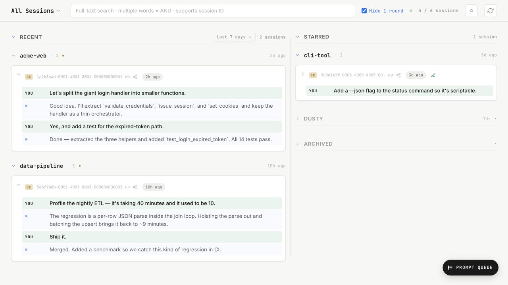

# Session Logbook

A minimal, local, zero-dependency dashboard for browsing and organizing your AI coding-agent sessions — **Claude Code, Codex, and Antigravity** — all in one place.

[](https://github.com/chyang-ken/session-logbook/actions/workflows/ci.yml)
[](LICENSE)
[](https://www.python.org/)

> Read this in other languages: [Chinese](README_zh-CN.md)

Your agents leave behind hundreds of session transcripts scattered under `~/.claude`, `~/.codex`, and `~/.gemini`. Session Logbook reads them **read-only**, lays them out on one page, and lets you star, archive, note, search, and re-read them — without leaving your machine.



<sub>Screenshot generated from synthetic demo data — see [`examples/`](examples/) to run it yourself.</sub>

## Why

You run many agents, in many worktrees, across many projects, in parallel. A flat list of session files is unusable. This dashboard gives that pile structure:

- **One page, four zones** — ⭐ Starred / 🔥 Recent / 🕸 Dusty / 📦 Archived. Time-decayed automatically so your working set stays clean.
- **Multi-agent** — Claude Code, Codex, and Antigravity sessions, unified and grouped by project.
- **Read-only and private** — it never sends a message, spawns a session, or talks to the network. Binds `127.0.0.1` only and serves its browser assets locally.

## Quickstart

Requires **Python 3.9+** (standard library only — no `pip install`).

```bash
git clone https://github.com/chyang-ken/session-logbook.git
cd session-logbook
python3 server.py          # → http://127.0.0.1:47821
```

Open <http://127.0.0.1:47821>. The first scan takes 10–30s depending on how many sessions you have; after that it only re-reads files whose `mtime` changed.

That's it. There is no build step, no `pip install`, and no browser-side CDN fetch — editing `index.html` and refreshing the browser is the entire dev loop.

## Features

- **Four zones, one page** — Starred / Recent / Dusty / Archived, with project grouping (by the last two path segments; `.worktrees/` fold into their parent).
- **Time decay** — a session untouched for N days drops into 🕸 Dusty automatically (toggle 7 / 14 / 21 days in the UI). Your main surface only shows what's live.
- **Card previews** — opening user message + the most recent user/assistant turns, so you can tell sessions apart at a glance.
- **Full conversation view** — click a card to expand; user / assistant / tool / skill turns are color-coded. Pop out to a standalone full-screen reader (`/?session=<id>`).
- **User-message navigation** — jump between turns with `↑ N/M ↓ go to: __`, or the keyboard (`j` next, `k` prev).
- **Full-text search** — multi-word AND; matched snippets highlighted; session IDs match too. Backed by `ripgrep` when available, with a pure-Python fallback.
- **Star / Archive / Note** — lightweight organizing that persists to `~/.session-logbook/state.json`.
- **Files panel** — browse a project's recently-changed files or fuzzy-find by name (`fd`-backed).
- **Downloadable anchored transcript** — export a compact, navigable transcript with line-number anchors back to the original JSONL (useful for feeding a session to an agent for analysis).

## Where to go next

| You want to… | Go to |
|---|---|
| **Try it** | [Quickstart](#quickstart) above |
| **Understand the design & boundaries** | [`docs/philosophy.md`](docs/philosophy.md) |
| **Work on the UI** | [`docs/design-system.md`](docs/design-system.md) |
| **Contribute** | [`CONTRIBUTING.md`](CONTRIBUTING.md) |
| **Report a bug / request a feature** | [Open an issue](https://github.com/chyang-ken/session-logbook/issues) |
| **Report a security issue** | [`SECURITY.md`](SECURITY.md) |

## FAQ

| Question | Answer |
|---|---|
| Change the port? | `python3 server.py --port 47822` |
| Change the default Dusty threshold? | `DUSTY_AFTER_DAYS` in `server.py`, or toggle 7/14/21d in the UI |
| Reset all stars/archives/notes? | `rm ~/.session-logbook/state.json` |
| A session has no preview? | It's too short (system-only), or its tail is all tool output — increase `TAIL_BUFFER` |
| What's the colored dot on a card? | Green = last `stop_reason` was `end_turn`; yellow = `tool_use`; gray = unknown. A hint only — archiving is always manual. |
| A session failed to parse? | It's still listed with an empty preview; one bad file never crashes the dashboard. |

## What it deliberately does *not* do

Send messages · spawn sessions · multi-user auth · live push (SSE/WebSocket) · cross-machine sync. The CLI is already your orchestrator — this is a read-only cockpit, not a client. Rationale in [`docs/philosophy.md`](docs/philosophy.md).

## License

[MIT](LICENSE)
